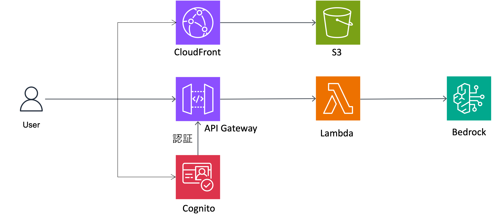

# Smart Minutes

講義動画・講義ファイル・文字書き起こしデータから自動で議事録を作成するツールです。

## 機能

- Amazon Bedrock の LLM モデル（Nova Lite または Nova micro）を使用したチャット機能
- Amazon Cognito によるユーザー認証
- API Gateway による安全な API アクセス
- CloudFront + S3 によるフロントエンドホスティング
- AWS CDK を使用したインフラのコード化

## アーキテクチャ



## 前提条件

- [Node.js](https://nodejs.org/) (v14 以上)
- [AWS CLI](https://aws.amazon.com/cli/) (設定済み)
- [AWS CDK](https://aws.amazon.com/cdk/) (v2)
- [Python](https://www.python.org/) (v3.9 以上)

## セットアップ手順

### 1. AWS 認証設定

.aws/credentials に以下情報を記載します。※region 以外の項目は AWS access portal ID からコピー可能です。

```
[893048189043_Student]
aws_access_key_id{記入}
aws_secret_access_key={記入}
aws_session_token={記入}
region = us-east-1
```

### 2. 必要なライブラリのインストール（初回のみ）

以下コマンド全て、ローカル (git bash, cmd など) で以下実行します。

```bash
npm install -g aws-cdk@latest
pip install python-pptx -t ./lambda

```

### 3. AWS アカウントのブートストラップ（初回のみ）

```bash
cdk bootstrap --profile 893048189043_Student

```

### 5. CDK スタックのデプロイ

コード修正後以下コマンドを実行すれば反映されます。`npm install`を実行すると postinstall でフロントエンドのビルドも完了します。  
※ lambda フォルダ内の requirements.txt を自動インストールするときに Docker 起動していないとエラーになります。要修正

```bash
npm install
cdk deploy --profile 893048189043_Student

```

### 6. アプリケーションへのアクセス

デプロイ出力に表示された [CloudFront URL] にアクセスしてアプリケーションを使用します。

使用方法

- CloudFront URL にアクセスします
- 「Create Account」をクリックして新しいアカウント(メールアドレス、パスワード)を作成します
- 登録したメールアドレスに送信された確認コードを入力します
- ログイン後、チャットインターフェースが表示されます
- メッセージを入力して Amazon Bedrock モデルと対話します
